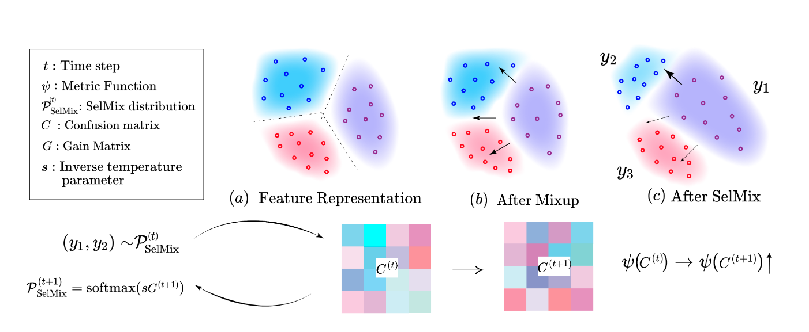

# Selective Mixup Fine-Tuning for Optimizing Non-Decomposable Objectives [ICLR 2024 Spotlight]
**Authors**: Shrinivas Ramasubramanian<sup>* </sup> , Harsh Rangwani <sup>* </sup> , Sho Takemori <sup>* </sup>, Kunal Samanta, Yuhei Umeda, Venkatesh Babu Radhakrishnan

This repo. contains code for our ICLR'24 spotlight [[paper](https://openreview.net/forum?id=rxVBKhyfSo)] "Selective Mixup Fine-Tuning for Optimizing Non-Decomposable Objectives" 


<p>
  
  <br />
  <em>Fig. 1: We demonstrate the effect of the variants of mixup on feature representations (a). With
Mixup, the feature representation gets equal contribution in all directions of other classes (b). Unlike
this, in SelMix (c), certain class mixups are selected at a timestep t such that they optimize the desired
metric. Above is an overview of how the SelMix distribution is obtained at timestep t</em>
</p>


```bib
@inproceedings{
ramasubramanian2024selective,
title={Selective Mixup Fine-Tuning for Optimizing Non-Decomposable Metrics},
author={Shrinivas Ramasubramanian and Harsh Rangwani and Sho Takemori and Kunal Samanta and Yuhei Umeda and Venkatesh Babu Radhakrishnan},
booktitle={The Twelfth International Conference on Learning Representations},
year={2024},
}
```


## TLDR
SelMix is a novel method for optimizing non-decomposable objectives in long-tail semi-supervised and supervised learning tasks. It formulates the problem as a multi-armed bandit, where each arm represents a pair of classes to perform mixup on. SelMix introduces a selection policy that assigns probabilities to class pairs based on their estimated gain in the objective, updated using validation feedback. 


## Installation

To install PyTorch's latest version, please refer to official [docs](https://pytorch.org/get-started/locally/). After installing the latest version of PyTorch for your GPU, create and activate your conda environment:
```bash
conda create --name your_env_name --file requirements.txt
conda activate your_env_name
```
Install the necessary libraries using 
```bash
pip install -r requirements.txt
```

### Weights & Biases (wandb)
Since we extensively log various detailed performance measures for the model, we strongly recommend that you install wandb before proceeding further. You can find the instruction [here](https://docs.wandb.ai/guides/hosting/self-managed/basic-setup)

## Usage
The usage guidelines using custom-models is provided in [Model Readme](./models/README.md)

## Training loop
Overview of the training pipeling

```python 
## Define your datasets for mixup; for the supervised case, they are assumed to be the same dataset
dataset1 = None
dataset2 = None 

# Placeholder for optimizer
optimizer = None

# Placeholder for Lagrange multipliers
lagrange_multipliers = None

# Loop through epochs
for epoch in range(num_epochs):
    # Perform validation and obtain confusion matrix and prototypes
    confusion_matrix, prototypes = validation(valset, model)
    
    # Calculate MinRecall objective and update Lagrange multipliers
    objective = MinRecall(confusion_matrix, prototypes, lagrange_multipliers)
    lagrange_multipliers = objective.lambdas
    
    # Obtain P_selmix and create FastJointSampler using the objective's P
    P_selmix = objective.P
    SelMix_dataloader = FastJointSampler(dataset1, dataset2, model, P_selmix)

    # Loop through steps in each epoch
    for step in range(num_steps_per_epoch):
        # Get batches from SelMix dataloader
        (x1, y1), (x2, y2) = SelMix_dataloader.get_batch()
        
        # Forward pass through the model with mixed inputs
        logits = model(x1, x2)
        
        # Calculate cross-entropy loss using labels from the first batch
        loss = F.cross_entropy(logits, y1)
        
        # Backward pass and optimization step
        loss.backward()
        optimizer.step()
        
        # Reset gradients for the next iteration
        optimizer.zero_grad()


```


## How to run

### Pre-training
We provide the code for pre-training your model using FixMatch and FixMatch w/ LA on various dataset configurations. The complete set of config files can be found in the ./configs directory with the following structure. Each dataset has configurations corresponding to its dataset distribution's pre-training for a given pre-training method and the corresponding config file for fine-tuning for a given objective.

```markdown
.
├── cifar10/
│   ├── DataDistribution/        
│       ├── GeometricMean.yaml
│       ├── ...
│       ├── OtherObjectives.yaml
│       ├── ...
│       └── MinRecall.yaml
│   ├── ...
│   └── ...
│   ├── pretraining/
│       ├── fixmatchLA.yaml
│       ├── fixmatchOriginal.yaml
├── cifar100/
├── imagenet1k/
└── stl10/
```

 To start the pre-training for vanilla FixMatch for CIFAR-10 with $\rho_l = 100, \rho_u = 100$ and $N_1$ = 150, $M_1$ = 300  run the following

```bash
python pretrain.py --config_file configs/cifar10/$N_1$-1500_$M_1$-3000_IBRL-100_IBRU-100/pretraining/fixmatchOriginal.yaml
```
We also provide the config file for pre-training with FixMatch w/ LA on the same datasets as

```bash
python pretrain.py --config_file configs/cifar10/$N_1$-1500_$M_1$-3000_IBRL-100_IBRU-100/pretraining/fixmatchLA.yaml
```

### Pretraining Checkpoints
We provide the seed 0 pre-training checkpoints for Fixmatch and Fixmatch w/ LA loss 

| Dataset  | CIFAR-10 | CIFAR-10 | CIFAR-10 | 
|----------|-----------------------|-----------------------|-----------------------|
|  | $N_1 = 1500, M_1 = 3000$ | $N_1 = 1500, M_1 = 3000$ | $N_1 = 1500, M_1 = 30$  | 
|          | $\rho_l = 100, \rho_u = 100$ | $\rho_l = 100, \rho_u = 1$ | $\rho_l = 100, \rho_u = 0.01$ |
|     Fixmatch     | [Google Drive Link](https://shorturl.at/HIY04) | [Google Drive Link](https://shorturl.at/agE45) | [Google Drive Link](https://api.wandb.ai/artifactsV2/default/stablegradients/QXJ0aWZhY3Q6Nzk1OTk0ODcx/9246d87ea88effe6b197e02e620820c1/model_best_CIFAR10_N1-1500_M1-30_IBRL-100_IBRU-1e-2_seed-0.pth?_gl=1*9rhhg9*_ga*NDQwNzUyMDk0LjE3MTE0MzY5NjU.*_ga_JH1SJHJQXJ*MTcxMzE2NTY2Ny42NC4xLjE3MTMxNjU4MTkuMzcuMC4w) |
|     w/ LA     | [Google Drive Link](https://shorturl.at/ltDUY) | [Google Drive Link](https://shorturl.at/zRWX8) | [Google Drive Link](https://shorturl.at/aeqW0) | 

| Dataset  | STL-10 | Imagenet-100 | CIFAR-100 |
|----------|---------------------|---------------------|---------------------|
|          | $N_1 = 450, M_1 = Unk$ |$N_1 = 433, M_1 = 866$ | $N_1 = 150, M_1 = 300$  |
|          | $\rho_l = 10, \rho_u = Unk$ | $\rho_l = 10, \rho_u = 10$ | $\rho_l = 10, \rho_u = 10$ |
|    FixMatch      | [Google Drive Link](https://api.wandb.ai/artifactsV2/default/stablegradients/QXJ0aWZhY3Q6Nzk1OTk0ODcx/00cfd5cae8b3712810b3deb048057c3d/model_best_stl10_N1-450_IBRL-10_IBRU-unk_seed-0.pth?_gl=1*13tbrw7*_ga*NDQwNzUyMDk0LjE3MTE0MzY5NjU.*_ga_JH1SJHJQXJ*MTcxMzE2NTY2Ny42NC4xLjE3MTMxNjU4MTkuMzcuMC4w) |[Google Drive Link](https://api.wandb.ai/artifactsV2/default/stablegradients/QXJ0aWZhY3Q6Nzk1OTk0ODcx/daaa59a4abf47ead09953d77ab6de765/model_best_Imagenet100_N1-433_M1-866_IBRL-10_IBRU-10_seed-0.pth?_gl=1*jplp37*_ga*NDQwNzUyMDk0LjE3MTE0MzY5NjU.*_ga_JH1SJHJQXJ*MTcxMzE2NTY2Ny42NC4xLjE3MTMxNjU4MTkuMzcuMC4w) |[Google Drive Link](https://shorturl.at/abimT) |
|    w/ LA      | [Google Drive Link](https://api.wandb.ai/artifactsV2/default/stablegradients/QXJ0aWZhY3Q6Nzk1OTk0ODcx/b33835c14db4afcb5899005730b42309/model_best_stl10_N1-450_IBRL-10_IBRU-unk_LA_seed-0.pth?_gl=1*1ta1hd9*_ga*NDQwNzUyMDk0LjE3MTE0MzY5NjU.*_ga_JH1SJHJQXJ*MTcxMzE2NTY2Ny42NC4xLjE3MTMxNjU4MTkuMzcuMC4w) | [Google Drive Link](https://api.wandb.ai/artifactsV2/default/stablegradients/QXJ0aWZhY3Q6Nzk1OTk0ODcx/43effbd50836b05a6b1ace37d1b3c581/model_best_Imagenet100_N1-433_M1-866_IBRL-10_IBRU-10-LA_seed-0.pth?_gl=1*jplp37*_ga*NDQwNzUyMDk0LjE3MTE0MzY5NjU.*_ga_JH1SJHJQXJ*MTcxMzE2NTY2Ny42NC4xLjE3MTMxNjU4MTkuMzcuMC4w) | [Google Drive Link](https://shorturl.at/nqzHM) |

### Fine-tuning
To start the fine-tuning, set the hyperparameters for the specific objective and dataset in the config file parameters and run the following
```bash
python trainMetricOpt.py --config_file configs/cifar10/$N_1$-1500_$M_1$-3000_IBRL-100_IBRU-100/MinRecall.yaml
```

### Results 
We obtain the following results when we run the fine-tuning process for the code. The metric reported in each table corresponds to the mean recall and min-recall for the fine-tuned FixMatch w/LA checkpoints.

#### Mean Recall

| Dataset | CIFAR-10 | CIFAR-10 | CIFAR-10 | CIFAR-100 | STL-10 | Imagenet-100 |
|----------|-----------------------|-----------------------|-----------------------|---------------------|---------------------|---------------------|
| | $N\_1 = 1500, M\_1 = 3000$ | $N\_1 = 1500, M\_1 = 3000$ | $N\_1 = 1500, M\_1 = 30$ | $N\_1 = 150, M\_1 = 300$ | $N\_1 = 450, M\_1 = Unk$ |$N\_1 = 433, M\_1 = 866$ |
| | $\\rho\_l = 100, \\rho\_u = 100$ | $\\rho\_l = 100, \\rho\_u = 1$ | $\\rho\_l = 100, \\rho\_u = 0.01$ |$\\rho\_l = 10, \\rho\_u = 10$ | $\\rho\_l = 10, \\rho\_u = Unk$ | $\\rho\_l = 10, \\rho\_u = 10$ |
| Fixmatch w/ LA | 80.1 | 93.5| 80.6|55.7 | | |
| w/ SelMix  | 85.3 |93.8|81.4 |56.1 | | |

#### Min/Min HT Recall

| Dataset | CIFAR-10 | CIFAR-10 | CIFAR-10 | CIFAR-100 (Min HT) | STL-10 | Imagenet-100 (Min HT) |
|----------|-----------------------|-----------------------|-----------------------|---------------------|---------------------|---------------------|
| | $N\_1 = 1500, M\_1 = 3000$ | $N\_1 = 1500, M\_1 = 3000$ | $N\_1 = 1500, M\_1 = 30$ | $N\_1 = 150, M\_1 = 300$ | $N\_1 = 450, M\_1 = Unk$ |$N\_1 = 433, M\_1 = 866$ |
| | $\\rho\_l = 100, \\rho\_u = 100$ | $\\rho\_l = 100, \\rho\_u = 1$ | $\\rho\_l = 100, \\rho\_u = 0.01$ |$\\rho\_l = 10, \\rho\_u = 10$ | $\\rho\_l = 10, \\rho\_u = Unk$ | $\\rho\_l = 10, \\rho\_u = 10$ |
| Fixmatch w/ LA |69.3 |83.3 | 63.1| 32.2| | |
| w/ SelMix  | 79.7| 88.4| 72.7|56.4 | | |


## Acknowledgements
Our pre-training code is based on the implementation [FixMatch-pytorch](https://github.com/LeeDoYup/FixMatch-pytorch).

